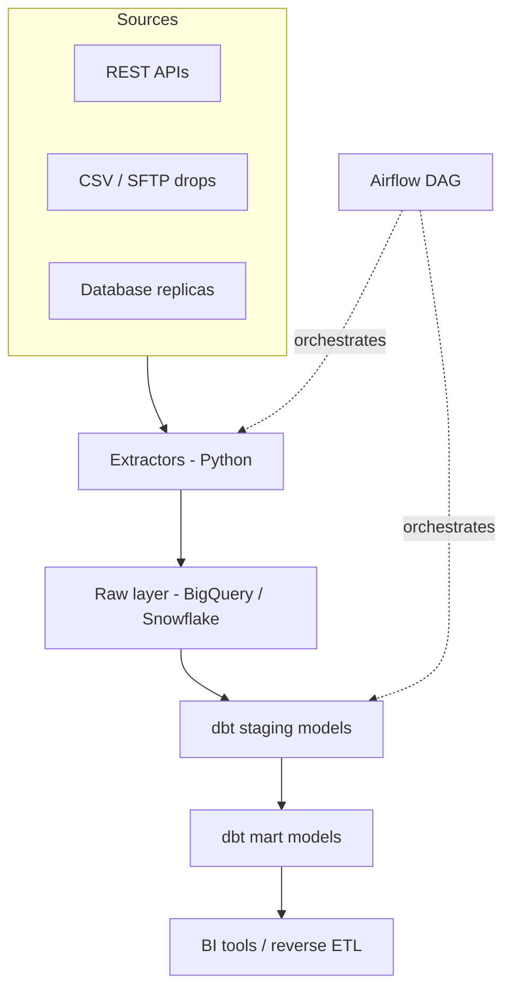

# Cloud Data Pipeline Framework

An extract, load, transform framework for standing up a proper data warehouse from scratch, the kind of setup I build at [motabar.builds.stuff](https://motabar.builds.stuff) when a client has data scattered across five tools and no single place to query it.

## The problem this solves

Small and mid sized teams usually don't need a huge data platform, they need their handful of sources landing reliably in one warehouse on a schedule, modeled cleanly enough that a dashboard or an analyst can actually trust it. This framework is that, kept intentionally simple rather than over-engineered.

## Architecture

## What's in here

* `python/extract_api_source.py` a generic, reusable extractor pattern for pulling from a paginated REST API and landing raw JSON in the warehouse
* `dbt_models/` staging and mart layer examples showing how raw data gets typed, deduplicated, and modeled
* `orchestration/dag_example.py` an Airflow DAG showing how the extract and transform steps get scheduled and chained with proper retry logic

## How it's used in practice

Every pipeline starts the same way regardless of the client: land raw data with no transformation, then let dbt handle everything else in a layer that's version controlled and testable. This means the extractors stay dumb and reliable, and all the business logic, currency conversion, deduplication, join logic, lives in dbt where it's actually visible and reviewable rather than buried in a script somewhere. The Airflow DAG handles retries and alerting on failure so a flaky API doesn't silently break the pipeline for a week before anyone notices.

## Stack

Python, BigQuery, Snowflake, dbt, Airflow
