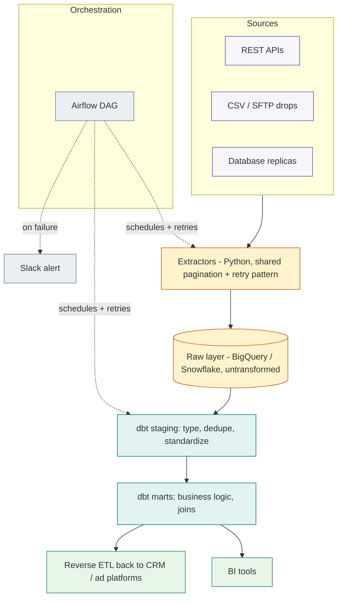

# Cloud Data Pipeline Framework

An extract, load, transform framework for standing up a proper data warehouse from scratch, the kind of setup I build at [motabar.builds.stuff](https://motabar.builds.stuff) when a client has data scattered across five tools and no single place to query it.

## The problem this solves

Small and mid sized teams usually don't need a huge data platform, they need their handful of sources landing reliably in one warehouse on a schedule, modeled cleanly enough that a dashboard or an analyst can actually trust it. Most attempts at this either over-engineer with a full data platform the team doesn't need, or under-engineer with scripts that quietly break and nobody notices for weeks. This framework aims for the middle: simple, reliable, and version controlled.

## Architecture

The extractors only ever land data, they never transform it. That split matters more than it looks: it means the extractors stay dumb and reliable, and all the business logic, currency conversion, deduplication, join keys, lives in dbt where it's version controlled, testable, and visible to anyone reviewing the project, instead of buried inside a script somewhere.

## What's in here

* `python/extract_api_source.py` a generic, reusable extractor pattern for pulling from a paginated REST API, with retry and backoff logic built in so a flaky endpoint doesn't take down the whole run
* `dbt_models/stg_crm_contacts.sql` a staging model example showing how raw data gets typed and deduplicated using a window function on load timestamp
* `orchestration/dag_example.py` an Airflow DAG showing how extraction and dbt run steps get scheduled, chained, and alerted on failure

## How it's used in practice

Every pipeline starts the same way regardless of the client: land raw data with no transformation, then let dbt handle everything else. The `APISourceConfig` dataclass in the extractor is deliberately generic, most new sources only need a new config instance rather than new extraction code, which keeps the codebase from growing a bespoke script per source. The Airflow DAG handles retries and failure alerting so a flaky API doesn't silently break the pipeline for a week before anyone notices, the retry count and backoff are visible right in the DAG definition rather than hidden in a try/except somewhere.

## Design decisions worth knowing

* **Raw layer has no primary key enforcement.** Deduplication happens in staging, not on load, because enforcing uniqueness at load time means a single malformed record can fail an entire batch.
* **Staging models are one-to-one with sources.** No joins happen until the mart layer, which keeps each staging model simple enough to reason about in isolation.
* **The DAG alerts on failure, not on every run.** A daily "pipeline succeeded" message trains people to stop reading Slack alerts, so this only interrupts anyone when something actually needs attention.

## Setup

1. Add a new `APISourceConfig` instance per data source you need to extract
2. Set up a BigQuery or Snowflake project with a `raw` dataset for landing tables
3. Configure the dbt project's `sources.yml` to point at the raw tables
4. Deploy `orchestration/dag_example.py` to your Airflow instance and set the Slack webhook connection

## Stack

Python, BigQuery, Snowflake, dbt, Airflow
